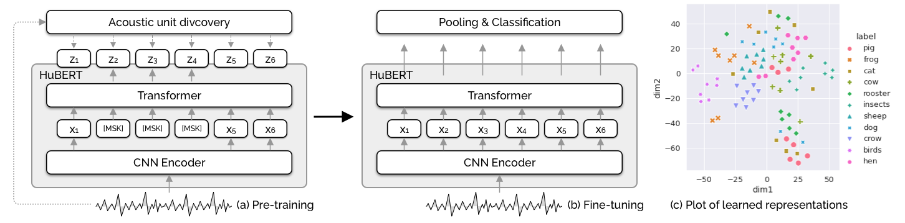

# AVES: Animal Vocalization Encoder based on Self-Supervision

Update (2024-06-05): 🦜 We are excited to introduce our latest series of AVES models, called BirdAVES, specifically scaled and trained for bird sounds. [Check out the details and pretrained models here](#birdaves).

Update (2024-07-05): See our note on [batching](#warning-about-batching-in-aves-models) in AVES models.

Update (2025-02-22): AVES release v0.1.2 as a package.

Update (2025-03-04): AVES package v0.1.3, bug fixes and more tests.

## What is AVES?



AVES (Animal Vocalization Encoder based on Self-Supervision) is a self-supervised, transformer-based audio representation model for encoding animal vocalizations ("BERT for animals"). It is based on HuBERT ([Hsu et al., 2021](https://arxiv.org/abs/2106.07447)), a powerful self-supervised model for human speech, but pretrained on large-scale unannotated audio datasets ([FSD50K](https://zenodo.org/record/4060432), [AudioSet](https://research.google.com/audioset/), and [VGGSound](https://www.robots.ox.ac.uk/~vgg/data/vggsound/)) which include animal sounds.

Comprehensive experiments with a suite of classification and detection tasks (from [the BEANS benchmark](https://github.com/earthspecies/beans)) have shown that AVES outperforms all the strong baselines and even the supervised "topline" models trained on annotated audio classification datasets.

See [our paper](https://arxiv.org/abs/2210.14493) for more details.

## How to use AVES

Create a virtual environment with anaconda by running, for example:

```
conda create -n aves python=3.10
conda activate aves
```

### Install from pip
```
pip install esp-aves
```
### Install from source
Clone this repository:

```
git clone https://github.com/earthspecies/aves.git
```

cd into the repo root folder and install the package:
```
pip install -e .
```
## Ported versions
The original model uses Fairseq models. We have ported the models to TorchAudio models and ONNX formats.

### TorchAudio
Download both the model and the model config under "TorchAudio version" in the [Pretrained models](#pretrained-models) section. You can also run this code in terminal:

```bash
wget https://storage.googleapis.com/esp-public-files/aves/aves-base-bio.pt
```

to download the `aves-base-bio.pt` model. Replace the filename to download the desired model.

#### Running AVES on Audio Files
AVES embeddings can be computed with the following command:
```
aves -c /path/to/your/config.json -m /path/to/model.pt --path_to_audio_dir ./example_audios/ --output_dir /path/to/save/embeddings/
```
What you need to input are 4 things:
1. The model config (see below, right click and "Save link as").
2. The model file (see below, click to download the model corresponding to the config you saved).
3. Path to a directory containing audio files (or specify individual files using `--audio_paths` parameter)
4. Path to save the embeddings for each file (`--output_dir` parameter)

Output embeddings can be saved as torch tensors (`--save_as pt`) or numpy arrays (`--save_as npy`)

#### Running tests
To run tests, from the root folder run ```pytest -v -s tests/```. One of the tests requires that you download the *birdaves-biox-large.onnx* model file and place it in a ./models folder in the repo root folder. If the model file is not found, this test will be skipped.

#### AVES feature extraction examples
These examples are based on the torchaudio version of the model weights.

Loading the feature extractor is done simply with this helper function.
```python
from aves import load_feature_extractor

# download the config and the torch model file
# here, config is stored in config/ and the model was put in models/
model = load_feature_extractor(
    config_path="./config/default_cfg_aves-base-all.json",
    model_path="./models/aves-base-all.torchaudio.pt",
    device="cpu",
    for_inference=True)  # for_inference sets model.eval()
```

Inference on audio files:
```python
# Load audio files from the example folder
from aves.utils import parse_audio_file_paths, load_audio
# Retrieve file paths
audio_file_paths = parse_audio_file_paths("./example_audios/")
print(audio_file_paths)

# Load and resample audio to 16 kHz
# Convert to mono by keeping only the first channel
audios = [load_audio(f, mono=True, mono_avg=False) for f in audio_file_paths]
# The loaded audio is stored as torch.Tensors, each of shape (num_samples,)
print(audios[0].shape)

# Compute durations of loaded audio in seconds
durations = [len(a) / 16000 for a in audios]
print(durations)

# Extract features from the last layer
# IMPORTANT: The extract_features method automatically adds a batch dimension.
features = [model.extract_features(audio, layers=-1) for audio in audios]
print(features[0])   # Shape: (batch, sequence_length, embedding_dim)
# Example output shape: torch.Size([1, 7244, 768])

# The sequence dimension (2nd dim) corresponds to time.
# AVES compresses time, mapping 1 second of 16 kHz audio to 49 steps.
print(int(features[0][1] // durations[0]))  # Output: 49

# Extract features from all layers
features = [model.extract_features(audio, layers=None) for audio in audios]
# AVES-all has 12 layers, so the output list length should be 12
assert(len(features[0]) == 12)
print(features[0][0].shape)
# Example output shape: torch.Size([1, 7244, 768])

# Extract features from the first and second-to-last layers
features = [model.extract_features(audio, layers=[0, -2]) for audio in audios]
# Expecting two layers in the output
assert(len(features[0]) == 2)
print(features[0][0].shape)
# Example output shape: torch.Size([1, 7244, 768])
```

#### Using AVES as a classifier
An example implementation for an AVES-based classifier is provided in `aves/aves.py` (`AVESClassifier`). This class's forward method returns a tuple of two items, the classification **loss** and the **logits** (unnormalized classifier outputs).

Example code for testing this is also provided in the same file.

### ONNX
Download the parameters and the model config under "ONNX version" in [Pretrained models](#pretrained-models).
> NOTE: We observed that the ONNX version of AVES-`all` and BirdAVES could have large relative differences compared to the original version when the output values are close to zero. The TorchAudio versions don't have this problem. When possible, use the TorchAudio version of the model.

An ONNX based feature extractor is provided in aves/aves_onnx.py *AvesOnnxModel*. 
> NOTE: ONNX models accept float32 numpy arrays as input and provide numpy arrays as outputs.

```python
from aves.aves_onnx import AVESOnnxModel

# example with BirdAVES large
model_path = "/path/to/birdaves-bioxn-large.onnx"
model = AVESOnnxModel(model_path)

# create random inputs for testing, 
# e.g. a batch of 2 audio files sampled at 16 KHz duration of 1 sec
inputs = np.random.randn(2, 16000).astype("float32")  # float64 doesn't work
onnx_out = model(inputs)
assert onnx_out.shape == (2, 49, 1024)  # embedding size is 1024 for BirdAVES large, dim 1 is time dimension
```

## Embedding dimensions

| Model Name | Embedding dim |
| ---------- | ------------- |
| AVES-core  | 768           |
| AVES-bio   | 768           |
| AVES-nonbio| 768           |
| AVES-all   | 768           |
| BirdAVES-biox-base | 768   |
| BirdAVES-biox-large | 1024 |
| BirdAVES-bion-large | 1024 |

## Pretrained models

| Configuration      | Pretraining data            | Hours     | TorchAudio version | ONNX version |
| ------------------ | --------------------------- | --------- | ------------------ | ------------ |
| AVES-`core`        | FSD50k + AS (core)          | 153       | [Model](https://storage.googleapis.com/esp-public-files/ported_aves/aves-base-core.torchaudio.pt) [Config](https://storage.googleapis.com/esp-public-files/ported_aves/aves-base-core.torchaudio.model_config.json) | [Model](https://storage.googleapis.com/esp-public-files/ported_aves/aves-base-core.onnx) |
| AVES-`bio`         | `core` + AS/VS (animal)     | 360       | [Model](https://storage.googleapis.com/esp-public-files/ported_aves/aves-base-bio.torchaudio.pt) [Config](https://storage.googleapis.com/esp-public-files/ported_aves/aves-base-bio.torchaudio.model_config.json) | [Model](https://storage.googleapis.com/esp-public-files/ported_aves/aves-base-bio.onnx) |
| AVES-`nonbio`      | `core` + AS/VS (non-animal) | 360       | [Model](https://storage.googleapis.com/esp-public-files/ported_aves/aves-base-nonbio.torchaudio.pt) [Config](https://storage.googleapis.com/esp-public-files/ported_aves/aves-base-nonbio.torchaudio.model_config.json) | [Model](https://storage.googleapis.com/esp-public-files/ported_aves/aves-base-nonbio.onnx) |
| AVES-`all`         | `core` + AS/VS (all)        | 5054      | [Model](https://storage.googleapis.com/esp-public-files/ported_aves/aves-base-all.torchaudio.pt) [Config](https://storage.googleapis.com/esp-public-files/ported_aves/aves-base-all.torchaudio.model_config.json) | [Model](https://storage.googleapis.com/esp-public-files/ported_aves/aves-base-all.onnx) |

## Colab Notebooks
- [Supervised classification task](https://colab.research.google.com/drive/1ZmCyxSXtMVde6L_31OUnZRRWHPIxGamh?usp=sharing)
- [Clustering](https://colab.research.google.com/drive/1dtBorrZkEfsn90Mj9SETF2DFAY9sjCqe?usp=sharing)

## BirdAVES

🦜 BirdAVES is our latest series of AVES models, specifically scaled and trained for bird sounds.

* **Training Data**: In addition to the `core` configuration used for AVES, we added a large amount of bird recordings from Xeno-canto and iNaturalist for self-supervised training of BirdAVES models.
* **Model Size**: While the earlier AVES models were based on the HuBERT `base` configuration (~95M parameters), we have now successfully trained `large` models (~316M parameters) with significant performance improvements.
* **Compute**: We significantly scaled up the training compute for BirdAVES models to achieve better performance.

See the table below for detailed information and pretrained models. *BEANS avg. (all)* is the average metrics measured across all datasets from the BEANS benchmark, while *BEANS avg. (birds)* is the average metrics from datasets (cbi, dcase, enabirds, and rfcx) that include bird sounds. For more details, refer to the [BEANS paper](https://arxiv.org/abs/2210.12300).

| Configuration        | Pretraining Data               | Hours | BEANS avr. (all) | BEANS avr. (birds) | Models    |
|----------------------|--------------------------------|-------|------------------|--------------------|-----------|
| AVES-`bio` (baseline)  | `core` + AS/VS (animal)          | 360   | 0.643            | 0.419              | See above |
| BirdAVES-`biox`-base   | `bio` + xeno-canto               | 2570  | 0.678            | 0.476              | <br/> [TorchAudio](https://storage.googleapis.com/esp-public-files/birdaves/birdaves-biox-base.torchaudio.pt) ([config](https://storage.googleapis.com/esp-public-files/birdaves/birdaves-biox-base.torchaudio.model_config.json)) <br/> [ONNX](https://storage.googleapis.com/esp-public-files/birdaves/birdaves-biox-base.onnx) |
| BirdAVES-`biox`-large  | `bio` + xeno-canto               | 2570  | **0.686**        | 0.511              | [TorchAudio](https://storage.googleapis.com/esp-public-files/birdaves/birdaves-biox-large.torchaudio.pt) ([config](https://storage.googleapis.com/esp-public-files/birdaves/birdaves-biox-large.torchaudio.model_config.json)) <br/> [ONNX](https://storage.googleapis.com/esp-public-files/birdaves/birdaves-biox-large.onnx) |
| BirdAVES-`bioxn`-large | `bio` + xeno-canto + iNaturalist | 3076  | 0.679            | **0.512**          | <br/> [TorchAudio](https://storage.googleapis.com/esp-public-files/birdaves/birdaves-bioxn-large.torchaudio.pt) ([config](https://storage.googleapis.com/esp-public-files/birdaves/birdaves-bioxn-large.torchaudio.model_config.json)) <br/> [ONNX](https://storage.googleapis.com/esp-public-files/birdaves/birdaves-bioxn-large.onnx) |

## Warning about batching in AVES models

Padding will affect the embeddings produced by AVES and BirdAVES models. That is, two sound signals $x$ and $x_z = \mathrm{concat}(x, \mathrm{zeros}(n))$ will give different embeddings for every frame. The `lengths` argument does not fix this issue.

This is a problem with the underlying HuBERT architecture, which could only be fixed in more recent architectures (see this [issue](https://github.com/pytorch/audio/issues/2242) and this [pull request](https://github.com/facebookresearch/fairseq/pull/3228) for more details).

This can cause confusion if you are using a model with batch size greater than 1, as the embeddings for a certain sound will depend on the batch. Therefore, we suggest pre-computing embeddings for the sounds in your dataset using `batch_size=1`. You can then pad these embeddings themselves, if using them in mini-batches for training a downstream network.
